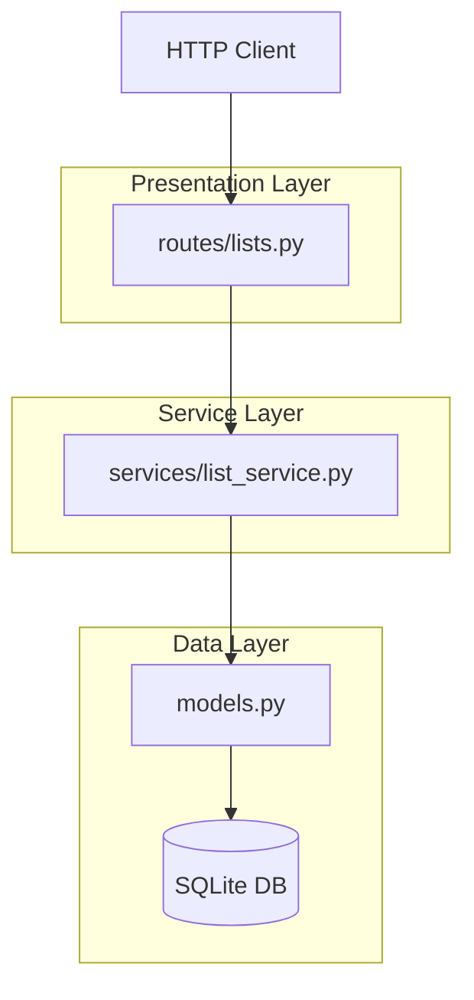

# GroceryList Architecture

A Flask-based API for shared grocery lists, following a Service-Route-Model architecture.

## Overview

The application is structured into three main layers to ensure locality and depth:
1. **Routes (Presentation)**: Handles HTTP requests, JSON parsing, and response formatting.
2. **Services (Business Logic)**: Contains the core domain logic, validations, and database orchestration.
3. **Models (Data)**: Defines the SQLAlchemy schemas and relationships.

## Data Flow

## Key Modules

### Lists Route (`routes/lists.py`)
- Defines endpoints for managing lists and items.
- Translates service exceptions into appropriate HTTP status codes (e.g., 404 for missing resources).

### List Service (`services/list_service.py`)
- **Deep Module**: Encapsulates all domain rules for purchasing and stats.
- Handles atomic database commits.

### Models (`models.py`)
- **Member**: User entity.
- **GroceryList**: Collection of items.
- **Item**: Individual products with purchase metadata.

## Design Decisions

See [docs/adr/](./docs/adr/) for detailed records of architectural and technical decisions.
